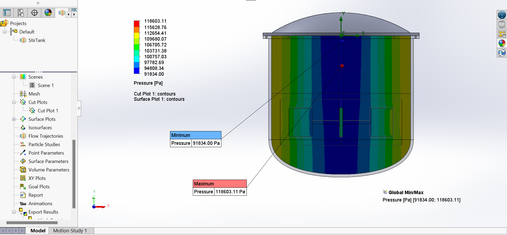

# SOLIDWORKS FLOW SIMULATION

# CFD Analysis of Hot–Cold Water Mixing in a T-Junction Duct  

## 📖 1. Introduction

Efficient fluid flow through ducting systems is essential in many engineering fields such as:

- HVAC systems  
- Thermal management of equipment  
- Chemical processing  
- Fluid transport networks  

This project presents a **numerical Computational Fluid Dynamics (CFD) study** of internal duct flow in a **T-junction mixing configuration**, where **hot water** and **cold water** enter through two separate inlets, mix inside the junction, and exit through a single outlet. All simulations were performed using **SolidWorks Flow Simulation**.

---

## 🛠️ 2. Software & Tools

- **Software**: SolidWorks  
- **Module**: SolidWorks Flow Simulation  
- **Analysis Type**: Internal flow (ducted flow with heat transfer)

SolidWorks Flow Simulation was chosen for its excellent CAD integration, ease of use, and reliable engineering-level CFD capabilities.

---

## 🏗️ 3. Model Description

The geometry consists of a **T-junction mixing duct** with:

- Two inlet ducts (hot fluid + cold fluid)  
- One outlet duct (mixed fluid)  
- Internal flow with **coupled thermal–fluid mixing behavior**

The model represents a typical **hot–cold fluid mixing junction** used in thermal control and fluid distribution systems.

---

## 🎯 4. Objectives of the Simulation

1. Analyze mixing behavior of hot and cold water streams  
2. Study outlet temperature distribution after mixing  
3. Evaluate velocity and pressure variations  
4. Assess effect of thermal mixing on fluid density  
5. Identify recirculation zones or flow disturbances  
6. Demonstrate capability of SolidWorks Flow Simulation for thermal-fluid problems

---

## ❓ 5. Study Questions

1. How do hot and cold inlet streams interact at the T-junction?  
2. What is the resulting temperature distribution at the outlet?  
3. How does velocity change due to flow mixing?  
4. What pressure variations occur across the junction?  
5. Are there recirculation zones or thermal stratification?  
6. How can mixing efficiency be improved through design changes?

---

## 📊 6. Measured Quantities

The simulation tracked the following parameters:

- Velocity (m/s)  
- Pressure (Pa)  
- Relative Pressure (Pa)  
- Temperature (°C)  
- Fluid Temperature (°C)  
- Fluid Density (kg/m³)  
- Vorticity (1/s)  
- Shear Stress (Pa)  
- Total Enthalpy Flux (W/m²)

---

## 📈 7. Results

### 7.1 Min / Max Values Table

| Parameter                     | Minimum          | Maximum         |
|-------------------------------|------------------|-----------------|
| Density (Fluid) [kg/m³]       | 958.22           | 1000.63         |
| Pressure [Pa]                 | 101317.01        | 101331.59       |
| Temperature [°C]              | 4.82             | 101.08          |
| Temperature (Fluid) [°C]      | 4.82             | 101.08          |
| Velocity [m/s]                | 0                | **0.139**       |
| Velocity (X) [m/s]            | -0.121           | 0.125           |
| Velocity (Y) [m/s]            | -0.066           | 0.069           |
| Velocity (Z) [m/s]            | -0.032           | 0.135           |
| Vorticity [1/s]               | 8.89 × 10⁻²⁷     | **14.97**       |
| Relative Pressure [Pa]        | -7.99            | 6.59            |
| Shear Stress [Pa]             | 0                | 0.38            |
| Total Enthalpy Flux [W/m²]    | -1.553 × 10⁸     | 6.952 × 10⁷     |

### 7.2 Graphical Outputs

## 📄 Download Full CFD Report

[⬇️ Download PDF](https://github.com/wisemansg/cfd/raw/main/CFD%20Analysis%20of%20Hot%E2%80%93Cold%20Water%20Mixing%20in%20a%20T-Junction%20Duct%20Using%20SolidWorks%20Flow%20Simulation.pdf)

---

---

## 🧠 8. Discussion

- **Low-velocity regime** — max velocity only **0.139 m/s**  
- Very small pressure variation → **stable flow**, low pressure losses  
- Wide temperature range (≈5 °C → 101 °C) confirms **effective thermal mixing**  
- Density variation follows temperature change (temperature-dependent density)  
- Increased **vorticity** near junction → localized mixing & flow interaction  
- Low shear stress values → flow remains stable

---

## 🔍 9. Interpretation & Engineering Significance

| Aspect                        | Observation / Result                              | Engineering Meaning / Significance                                                                                   |
|-------------------------------|----------------------------------------------------|-----------------------------------------------------------------------------------------------------------------------|
| **Temperature Results**       | Wide range: 4.82 °C – 101.08 °C                   | Indicates strong thermal mixing. Outlet temperature converges toward intermediate value → effective mixing performance |
| **Velocity & Flow Behavior**  | Maximum velocity only 0.139 m/s                   | Low-speed regime typical for controlled mixing systems where high turbulence is undesirable                             |
| **Pressure & Energy**         | Minimal pressure variation (very low drop)        | Energy-efficient design → lower pumping power required, reduced operational energy cost                               |
| **Density Variation**         | 958.22 – 1000.63 kg/m³ (temperature-dependent)    | Confirms importance of using temperature-dependent fluid properties in CFD simulations                                 |
| **Vorticity & Mixing**        | Increased vorticity near the T-junction           | Localized rotational structures enhance mixing without causing excessive turbulence or flow instability               |
| **Shear Stress**              | Very low values (max 0.38 Pa)                     | Flow remains stable and well within safe operating limits for most ducting applications                               |
| **Overall Design Performance**| Stable flow, effective mixing, minimal losses     | T-junction geometry performs well for hot–cold water blending → good baseline for real-world applications             |
| **Limitations**               | Steady-state only, low velocities, no turbulence model comparison | Transient behavior, higher flow rates, and experimental validation recommended for future work                        |

### Limitations  
- Steady-state analysis only  
- Low flow velocities  
- No turbulence model comparison  
- No experimental validation performed

---

## ✅ 10. Conclusion

This study successfully demonstrated **SolidWorks Flow Simulation** for analyzing **hot–cold water mixing** in a T-junction duct.

**Key takeaways:**

- Stable and efficient flow behavior  
- Very low pressure losses  
- Effective thermal mixing  
- Clear coupling between temperature and density  
- CFD provides valuable insight difficult to obtain experimentally

---

## 🏭 11. Industrial Applications

- **HVAC systems** — mixing and distribution ducts  
- **Power plants** — cooling water systems  
- **Chemical & process industries** — fluid routing & blending  
- **Automotive** — air intake / exhaust duct design  
- **Electronics cooling** — airflow and thermal management

---

## 🚀 12. Future Work & Recommendations

- Transient (time-dependent) mixing analysis  
- Turbulent flow simulations (higher velocities)  
- Geometry optimization for better mixing / lower pressure loss  
- Comparison with different turbulence models  
- Experimental validation of CFD results  
- Parametric study (inlet temperatures, flow rates, junction angles)

---

# 🌀 Stirred Tank Mixing Simulation

**Transient CFD Analysis of Impeller-Driven Mixing Using SolidWorks Flow Simulation**

---

## 📖 Project Overview

This project simulates the mixing process inside a cylindrical stirred tank equipped with a rotating agitator. A dyed water tracer is used to visualize and quantify how effectively the impeller disperses the fluid over time. The simulation captures transient flow patterns, velocity fields, vorticity, shear stress, torque requirements, and tracer concentration distribution — providing valuable insights into real-world mixing performance.

---

## 🎯 Objectives

1. Evaluate mixing efficiency through dispersion of a dyed tracer  
2. Analyze flow patterns, velocity distribution, and turbulence generated by the impeller  
3. Determine torque on the agitator for power consumption estimation  
4. Identify potential dead zones or regions of poor mixing  
5. Demonstrate capability of SolidWorks Flow Simulation for transient stirred tank analysis  
6. Generate data useful for impeller design optimization and scale-up decisions

---

## 🛠️ Software & Tools

- **Software**: SolidWorks  
- **Module**: SolidWorks Flow Simulation  
- **Analysis Type**: Internal, transient, rotating regions, species transport  
- **Key Capabilities Used**:  
  - Rotating region (impeller)  
  - Time-dependent simulation  
  - Tracer mass fraction tracking  
  - Turbulence modeling

---

## 🏗️ Model & Setup Summary

- **Geometry**: Cylindrical tank with domed top + central rotating agitator  
- **Fluid**: Water + dyed water tracer  
- **Initial Conditions**:
  - Temperature: 293.20 K (20 °C)  
  - Pressure: 101 325 Pa  
  - Velocity: 0 m/s  
  - Mass fraction – Water (Dyed): **0.5000**  
  - Turbulence intensity: 2.00 %  
  - Turbulence length: 0.014 m  

- **Boundary Conditions**: Closed system (no inlet/outlet)  
- **Engineering Goals**:
  - Fluid area on agitator surfaces  
  - Torque about Y-axis on impeller  

- **Simulation Time**: ~10 604 seconds (≈ 2 h 57 min)  
- **Iterations**: 490

---

## 📊 Results – Global Min / Max Values

| Parameter                            | Minimum      | Maximum      | Comment / Concern                              |
|--------------------------------------|--------------|--------------|------------------------------------------------|
| Density (Fluid) [kg/m³]              | 997.56       | 997.56       | Constant – incompressible assumption valid    |
| Mass Fraction of Water (Dyed) [ ]    | **0.4860**   | **0.9438**   | Wide range → incomplete mixing at this time   |
| Velocity [m/s]                       | 0            | **5.842**    | Peak at impeller tip – relevant for erosion    |
| Vorticity [1/s]                      | 0.08         | **77.40**    | High near impeller – strong turbulence zone    |
| Shear Stress [Pa]                    | 0            | **100.20**   | High shear – concern for shear-sensitive media |
| Torque (Y) on agitator [N·m]         | —            | **113.2**    | Critical for motor sizing & energy cost        |
| Pressure [Pa]                        | 91 834       | 118 603      | Reasonable variation due to pumping action     |
| Temperature [K]                      | 293.20       | 293.21       | Negligible change – isothermal mixing          |

---

## 🖼️ Visualization Highlights

## 📄 Download Full Report (PDF)

[⬇️ Download PDF](./cfdassets/Stirred%20Tank%20Mixing%20Simulation.pdf)
---

## 🧠 Discussion – Key Engineering Insights

### Mixing Uniformity
- Mass fraction range **0.486 – 0.943** indicates partial mixing at the simulated time step.  
- Persistent low-concentration zones (minimum 0.486) suggest **dead zones** near the bottom or walls — a common industrial challenge.  
- Achieving <5% variation across the tank is a typical target for quality-critical processes.

### Flow & Turbulence
- Peak velocity **5.84 m/s** at impeller blades creates strong circulation.  
- High vorticity (**77.4 1/s**) near the impeller confirms effective turbulence generation — essential for dispersion.  
- Low vorticity regions (0.08 1/s) indicate possible stagnant zones.

### Mechanical & Energy Aspects
- **Torque ≈ 113 N·m** is realistic and critical for motor selection and power estimation.  
- **Shear stress up to 100 Pa** is acceptable for many applications but must be limited in shear-sensitive processes (e.g., cell cultures, emulsions).

### Temperature & Density
- Negligible temperature change confirms isothermal behavior.  
- Constant density validates incompressible flow assumption.

---

## 🔍 Interpretation & Real-World Significance

| Aspect                  | Observation                          | Industrial Concern / Implication                              |
|-------------------------|--------------------------------------|----------------------------------------------------------------|
| **Mixing Completeness** | Wide tracer concentration range      | Dead zones → risk of inconsistent product quality             |
| **Velocity & Vorticity**| High near impeller                   | Good dispersion but increased blade/tank wear risk            |
| **Shear Stress**        | Up to 100 Pa                         | Critical for shear-sensitive materials (biotech, emulsions)   |
| **Torque / Power**      | 113 N·m                              | Directly affects motor size, energy cost, and OPEX            |
| **Dead Zones**          | Visible low-velocity regions         | May cause settling, poor reaction uniformity, off-spec product|

---

## ✅ Conclusion

This transient CFD study successfully demonstrates the capability of **SolidWorks Flow Simulation** to model impeller-driven mixing in a stirred tank. The simulation reveals strong circulation near the agitator but highlights the presence of low-mixing zones at the current time step. Calculated torque and shear values provide practical engineering data for equipment sizing and process safety. The results confirm CFD as a powerful tool for predicting mixing behavior, optimizing impeller design, and reducing expensive physical trials.

---

## 🏭 Real-World Industrial Applications 

- **Pharmaceutical & Bioprocessing** — uniform mixing in bioreactors for monoclonal antibodies, vaccines, cell therapies  
- **Chemical Industry** — polymerization, crystallization, pH control, and catalytic reactions  
- **Food & Beverage** — blending of sauces, dairy products, beverages, and fermentation processes  
- **Paints, Coatings & Inks** — dispersion of pigments and achieving stable emulsions  
- **Water & Wastewater Treatment** — flocculation, neutralization, and chemical dosing tanks  
- **Cosmetics & Personal Care** — emulsification of creams, lotions, and homogeneous product formulation  

Accurate mixing simulation reduces batch-to-batch variability, improves yield, lowers energy use, and accelerates scale-up from lab to production.

---

## 🚀 Future Work & Recommendations

- Extend simulation time to reach full homogenization  
- Compare different impeller designs (Rushton, pitched blade, hydrofoil, etc.)  
- Perform parametric studies: RPM, baffle configuration, fill level  
- Include multiphase flow (gas dispersion, solid suspension)  
- Validate against experimental PIV / dye tests or torque measurements  
- Couple with heat transfer or chemical reaction models

---
